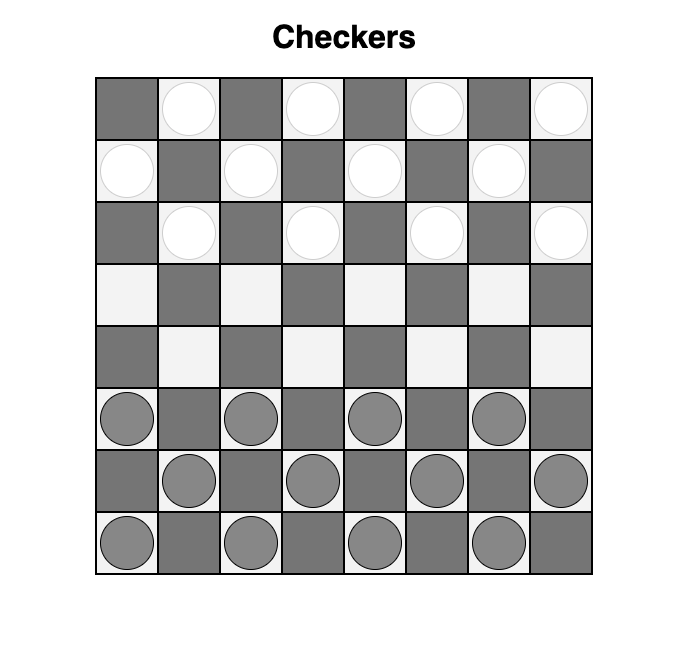

## Checkers Board 
### Objective
In this exercise, you will build a checkers board layout. Use **CSS Grid** to define the board's structure and **JavaScript** to dynamically generate the squares and place the game pieces based on a data array.

<p style="text-align: center;">
  
</p>

### Part 1: HTML Structure
Create a basic HTML shell. You only need a container element where the board will live. 
1. Create an `index.html` file.
1. Add a `<div>` with the class `.board` inside the <body>.
1. Link your CSS and JavaScript files.

### Part 2: Styling with CSS Grid
Create an $8 \times 8$ grid for the board.
1. **The Board:** 
    - Target the `.board` class.
    - Use `display: grid;` to turn it into a grid container. 
    - Define 8 columns and 8 rows of equal size (e.g., `1fr` or `50px`).
    - Give the board a border and set `width: max-content;`.

1. **The Squares:** 
    - Create two classes: `.white-square` and `.black-square`. Assign them different background colors (e.g., #eee and #555).
1. **The Pieces**: 
    - Create a `.piece` class.
    - Give it a circular shape (border-radius: 50%), a width/height (about 80% of the square size), and center it within the square.
    - Create `.white-piece` and `.black-piece` classes for the different piece colors.
### Part 3: JavaScript Logic
Instead of hard-coding 64 div elements in HTML, you will generate them using JavaScript.

1. The Data RepresentationUse a 2D Array to represent the board state. `w` stands for White, `b` for Black, and `''` for empty.
```JavaScript
const gBoard = [

    ['', 'w', '', 'w', '', 'w', '', 'w'],
    ['w', '', 'w', '', 'w', '', 'w', ''],
    ['', 'w', '', 'w', '', 'w', '', 'w'],
    ['', '', '', '', '', '', '', ''],
    ['', '', '', '', '', '', '', ''],
    ['b', '', 'b', '', 'b', '', 'b', ''],
    ['', 'b', '', 'b', '', 'b', '', 'b'],
    ['b', '', 'b', '', 'b', '', 'b', '']
]
```
2. **The Generation Function**

Write a function that loops through the gBoard matrix and builds the HTML string for the board and pieces. 

For each cell:

- **Create a Square:** use a `<div>`.
- **Determine Color:** Implement the logic to determine square color, and add the appropriate class.
- **Create Pieces:** If the value in the array is 'w' or 'b', create another div for the piece and insert it into the square. Again, add the appropriate classes.

Inject the dynamicly generated HTML square to the .board container. 

### Bonus Challenges
If you finish early, try these:

- **Hover Effects:** Add a highlight color when a user hovers over a square
- **Responsive Board:** Make the board size relative to the viewport (using vw units) so it scales on mobile.